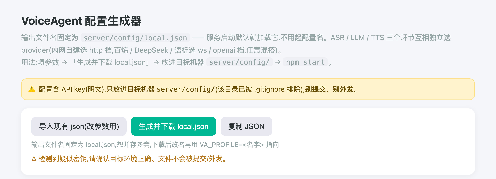
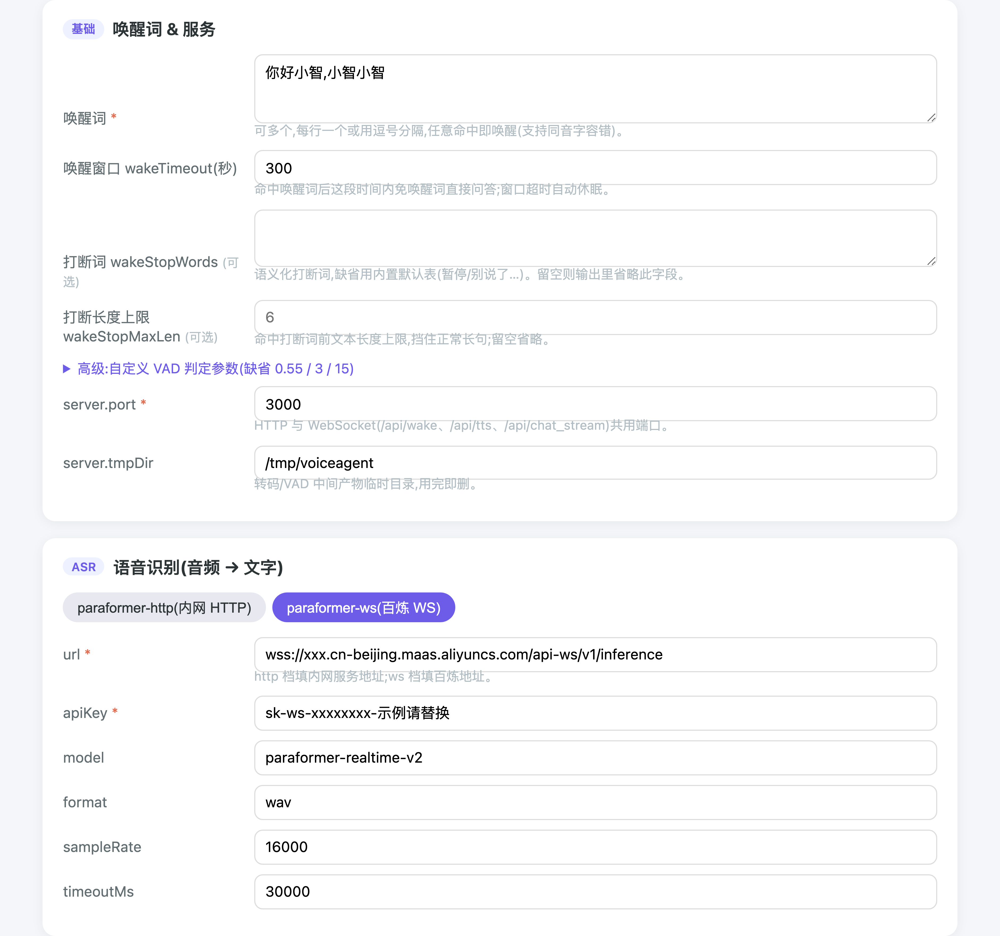
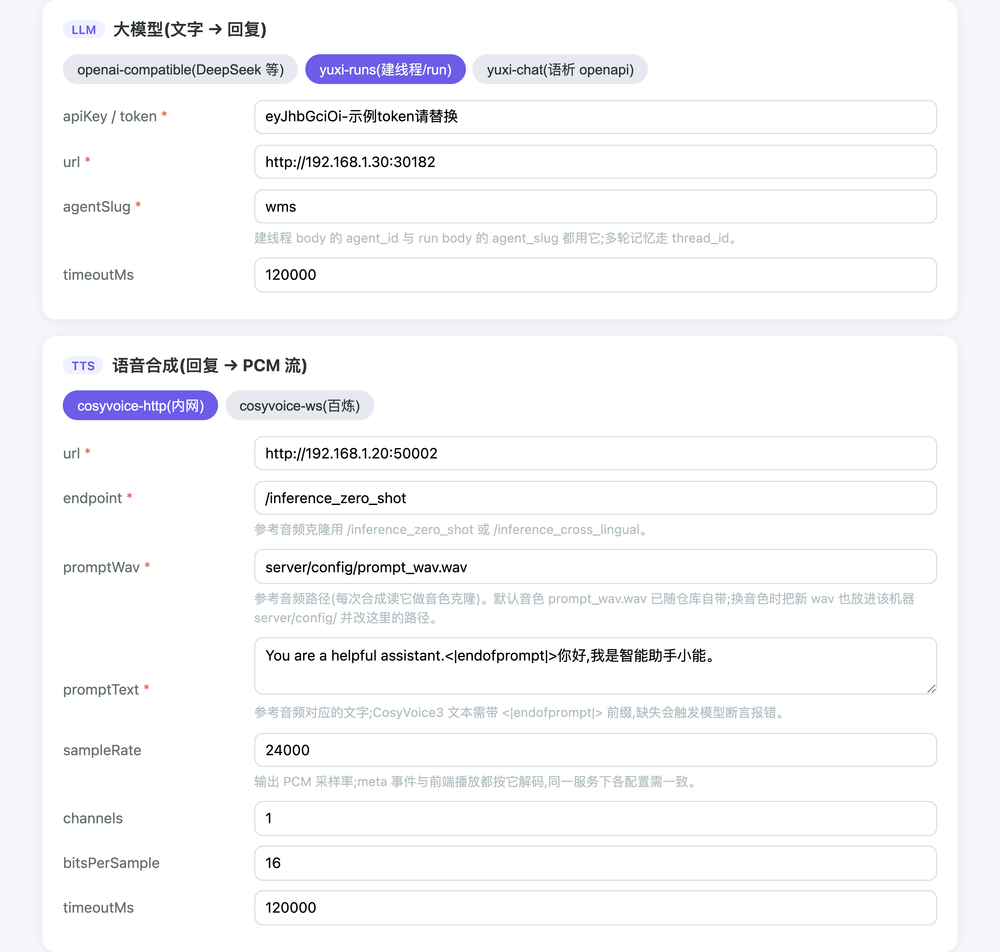
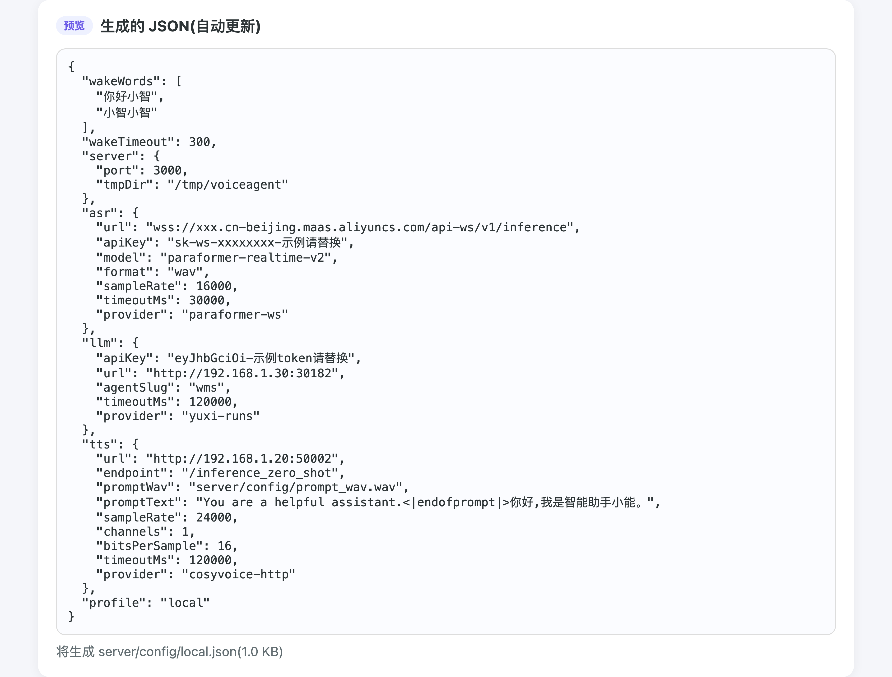

# VoiceAgent 语音代理

浏览器录音 → ASR 识别 → LLM 生成回复 → TTS 合成 → 浏览器播放,一个完整的语音问答闭环。后端在 ASR 之前用 Silero VAD 裁掉首尾静音,只把有效语音送识别。

支持**三路问答**,共享同一份多轮记忆(同一 `sessionId` 内连续问答带上下文):

| 方式 | 接口 | 说明 |
| --- | --- | --- |
| 语音问答 | `POST /api/chat?stream=1` → `WS /api/chat_stream` | 先上传录音识别成文本,再连流式通道问答(两跳) |
| 文字问答 | `WS /api/chat_stream` | 直接发文本,后端一条龙流式 LLM→TTS |
| 唤醒词免按键 | `WS /api/wake` | 前端常驻推 16k int16 PCM,命中唤醒词自动回答(带问题走 `/api/chat_stream` 流式) |

**流式问答(文字/语音)**:经 `WS /api/chat_stream` 后端一条龙 `LLM 流式增量 → 断句器切句 → 逐句 TTS → 顺序推 PCM`,首句音频不必等整段回复生成完,降低首字延迟。唤醒命中也走 `WS /api/chat_stream`(带问题时),只说唤醒词回固定问候仍走 `/api/tts`。

## 快速启动

```bash
npm install                # 只装一次(Node >= 18)
npm start                  # 直接启动,无需 VA_PROFILE —— 自动找配置(见下)
```

> 配置固定为 `server/config/local.json` —— 启动默认就加载它(想在一台机器上并存多套,才用 `VA_PROFILE=<名字>` 指向别的文件)。`local.json` 不存在就**控制台报错并自动打开配置网页**(见下节):生成并下载 local.json → 放进 `server/config/` → 重新 `npm start`。

浏览器打开 `http://localhost:<port>`(port 取该配置的 `server.port`)。演示页 [public/index.html](public/index.html) 基于 SDK、`autoWake:true` 加载即监听,首次需点击页面授权麦克风(浏览器 autoplay 限制)。

配置生成与修改(新部署、改唤醒词/换 provider 都在这):见下文 [「用配置生成器生成/修改配置」](#用配置生成器生成修改配置推荐)。

**环境要求**:Node >= 18;系统装有 `ffmpeg`(`audio.js` 转码用)。

**首次 clone 需两步**(均已被 gitignore,仓库里没有):

1. 用 [public/config-builder.html](public/config-builder.html) 生成,或按 [server/config/README.md](server/config/README.md) 手写 `server/config/` 下的配置文件(含 API key,别提交);没配置时直接 `npm start` 会报错并自动打开生成页。
2. 准备 `server/models/silero_vad.onnx`(v5 分发版,官方 snakers4 版局部推理异常)。

无测试/无 lint/无构建,前端 SDK 是无打包的 IIFE。

## 用「配置生成器」生成/修改配置(推荐)

把 [public/config-builder.html](public/config-builder.html) 当"配置工具页":在任何一台要部署的机器上打开,生成**固定一份 `server/config/local.json`**(不用起名字);ASR、LLM、TTS 三个环节**互相独立**选实现,想哪几个上云就选哪几个。

**① 打开方式**

| 方式 | 怎么开 | 能做什么 |
|---|---|---|
| **任意机器**(双击/拖到浏览器) | 拷 `public/config-builder.html` 直接打开(纯前端,离线可用,本页即下载工具,不依赖服务) | 填参数 →「生成并下载」`local.json` → 放进该机器 `server/config/` |

> 💡 全新机器上也可以直接 `npm start`(此时 `server/config/` 下没有可用配置):控制台会报错说明缺配置,并**自动打开本页**(引导模式);生成并下载 json、放进 `server/config/` 后重新 `npm start` 即完成初始化(想改就再下载覆盖,不用删旧文件)。

**② 两步生成**

1. 三个环节各点选 **provider** 并填地址/密钥(内网自建选 http 档,百炼/DeepSeek/语析选 ws / openai 档);已有配置想改:点「导入现有 json」载入旧文件,改字段即可,不用重新手填;
2. 点「**生成并下载**」→ 得到 `local.json`,放进目标机器的 `server/config/`(替换同名文件)即可。

**③ 生效**:重新 `npm start` 即加载新的 `local.json`(想并存多套,把下载文件改名后用 `VA_PROFILE=<名字> npm start` 指向)。

> 内网 CosyVoice 音色克隆的**参考音频**:把 wav 也放进该机器 `server/config/` 并把 `promptWav` 指过去即可(默认音色 `prompt_wav.wav` 已随仓库自带)。

> 下图为演示数据,地址/密钥全是假的,别照抄;黄色△是"检测到疑似密钥"的提醒,属正常提示。真实 json 含密钥,只放本机 `server/config/`,别提交、别外发。









## 配置:固定一份 local.json,内容按需生成

配置**固定为 `server/config/local.json`**,启动时加载它(想在一台机器上并存多套,把文件改名后 `VA_PROFILE=<名字> npm start` 指向即可)。**档位/名字不绑定行为**——内容由生成器按部署需要拼:**每个环节(asr/llm/tts)各自用 `provider` 字段选实现**:内网自建服务用 http 档,云服务(百炼/DeepSeek/语析)用 ws / openai 档,任意混搭 —— 哪几个环节上云、哪几个走内网,完全由你按当前机器可用的服务决定。

仓库目录里若还留着 `online.json` / `local1.json` 等旧文件,只是历史示例,不影响启动(固定只读 `local.json`,其他可自行清理);字段与完整示例见 [server/config/README.md](server/config/README.md)。

## 目录结构

```text
server/
├── index.js     # Express 入口 + /api/chat + 共享 WebSocketServer(/api/wake、/api/tts、/api/chat_stream)
├── config.js    # 加载固定 server/config/local.json(多套并存才用 VA_PROFILE 指向);缺文件则报错 + 配置引导(开网页)
├── config/      # 配置(固定 local.json,含 key,gitignore 不入库;字段说明见 config/README.md)
├── audio.js     # ffmpeg 转码(webm → 16k mono wav)、临时文件清理
├── vad.js       # Silero VAD 静音裁剪(onnxruntime-node 推理)+ 流式 VAD
├── models/      # silero_vad.onnx 模型文件
├── asr.js       # 音频 → 文字(local HTTP / 百炼 WS 分流)
├── llm.js       # 文字 → 回复(openai-compatible / yuxi-chat 分流,多轮记忆)
├── tts.js       # 回复 → PCM 流(local HTTP / 百炼 WS 分流)
├── wake.js      # 流式开口段检测 + 唤醒词匹配(拼音模糊)+ 自动回答
├── turn.js      # 会话表(sessionId → 多轮上下文,三路共用)
├── timing.js    # 链路耗时打点(Timing→mark→log)
└── bailian.js   # 阿里云百炼 WebSocket 客户端(ASR + TTS)

public/
├── voice-agent.js      # 前端 SDK(VoiceAgent 类,一个入口封装三路问答 + 自动 TTS 播放)
├── index.html          # 接口演示页(只调 SDK 的 UI 示例)
└── config-builder.html # 配置生成器(纯前端):填参数 → 下载 local.json,放进 server/config/(用法见上节)
```

## 相关文档

- [docs/API.md](docs/API.md) — 接入文档(SDK 用法 + 后端接口协议 + 跨域部署)
- [server/config/README.md](server/config/README.md) — 配置字段说明与完整示例
